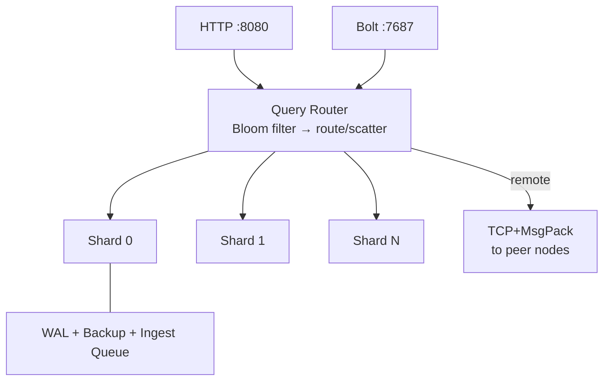

# Loveliness

[](https://github.com/dreamware-nz/loveliness/actions/workflows/ci.yml)
[](https://go.dev)
[](LICENSE)
[](https://hub.docker.com/r/dreamwarenz/loveliness)

A clustered graph database built on [LadybugDB](https://github.com/LadybugDB/ladybug) — like Elasticsearch is to Lucene, Loveliness is to LadybugDB.

> *A "loveliness" is the collective noun for a group of ladybugs.*

LadybugDB is a Kuzu fork — a fast, embedded, columnar graph engine with Cypher support. Loveliness wraps it in a distributed layer: hash-based sharding, Raft consensus, Bloom filter routing, edge-cut replication, and Neo4j Bolt protocol compatibility. Single Go binary, no external dependencies.

## Architecture



## Performance

### Local (15.7M nodes, 10M edges, 4 shards — Apple M1 Pro)

| Query Type | P50 | QPS |
|---|---|---|
| Point lookup | **425us** | 10,758 |
| 1-hop traversal | **673us** | 1,106 |
| Single write | **365us** | 2,526 |
| Aggregation | **57ms** | 16 |
| 2-hop traversal | **162ms** | 5 |
| Bulk load | **70–190K nodes/sec** | — |

### Cluster (23M nodes, 23M edges, 6 shards — 3-node Fly.io)

Tested on 3× performance-16x machines (48GB RAM each), sjc region. 200 iterations, 8 concurrent workers. Benchmark binary runs inside the cluster on localhost for true in-network latencies.

| Query Type | P50 | P95 | QPS |
|---|---|---|---|
| Point lookup | **1.2ms** | 2.4ms | 710 |
| Point lookup (8 workers) | **1.1ms** | 1.7ms | **6,831** |
| Range filter | **2.7ms** | 3.6ms | 366 |
| 1-hop traversal | **4.7ms** | 187ms | 31 |
| 2-hop traversal | **121ms** | 152ms | 8 |
| Shortest path (1..6) | **31ms** | 53ms | 28 |
| Group-by aggregation | **246ms** | 258ms | 4 |
| Single write | **1.8ms** | 2.9ms | 537 |
| Bulk node load | **9,600/sec** | — | — |
| Bulk edge load | **136,000/sec** | — | — |

### Scale progression

| Dataset | Shards | Point lookup P50 | Concurrent QPS | Group-by P50 |
|---|---|---|---|---|
| 10M / 10M | 3 | 1.4ms | 1,792 | — |
| 20M / 20M | 3 | 863us | 1,991 | 838ms |
| 23M / 23M | 6 | 1.2ms | **6,831** | 246ms |

Point lookups stay sub-2ms through 23M. Doubling shards from 3→6 tripled concurrent QPS and cut full-scan aggregations by 3x.

<!-- BENCHMARK_START -->
<!-- BENCHMARK_END -->

### Reproduce Benchmarks

```bash
# Full comparison: Loveliness (1-node, 3-node) vs Neo4j CE
./bench/run.sh

# Quick check: single-node Loveliness only
./bench/run.sh --quick

# Custom dataset size
./bench/run.sh --nodes=500000 --edges=500000
```

Results land in `bench/results/<timestamp>/` with JSON data, SVG charts, and a markdown comparison report. CI runs the full comparison on each release and opens a PR with updated results.

Full benchmarks and comparisons with Neo4j, Memgraph, TigerGraph, Neptune, and JanusGraph: [docs/benchmarks.md](docs/benchmarks.md)

## Neo4j Driver Compatibility

Speaks Bolt v4.x on `:7687`. Use any Neo4j driver — just change the URL. Both `bolt://` (direct) and `neo4j://` (routing with automatic failover) are supported.

```python
from neo4j import GraphDatabase

# Direct connection
driver = GraphDatabase.driver("bolt://localhost:7687")

# Routing + automatic failover (recommended for clusters)
driver = GraphDatabase.driver("neo4j://localhost:7687")

with driver.session() as session:
    result = session.run("MATCH (p:Person {name: $name}) RETURN p.name, p.age", name="Alice")
```

72/72 exhaustive tests pass with the official Python driver. Details: [docs/bolt.md](docs/bolt.md)

## Quick Start

**Fastest way** — one command, real 3-node Raft cluster on your laptop:

```bash
loveliness up 3
```

That's it. Three nodes, auto-configured ports, auto-bootstrap. Connect at `bolt://localhost:7687` or `http://localhost:8080`.

**From source:**

```bash
git clone https://github.com/dreamware-nz/loveliness.git && cd loveliness

make build      # requires LadybugDB: curl -fsSL https://install.ladybugdb.com | sh
make run        # single node → :8080 (HTTP), :7687 (Bolt)
make docker     # 3-node cluster via Docker Compose
make test       # 260 tests across 12 packages
```

**Deploy to Fly.io** — zero-config cloud cluster in under 5 minutes:

```bash
cd deploy/fly
fly launch
fly scale count 3
```

DNS auto-discovery handles peer finding. No manual peer configuration needed. See [Fly.io deployment docs](deploy/fly/) for details.

## Usage

**CLI:**

```bash
loveliness help                                           # show all commands
loveliness up 3                                           # 3-node local cluster
loveliness query "MATCH (p:Person {name: 'Alice'}) RETURN p"  # query a running server
loveliness version                                        # show version
```

Set `LOVELINESS_URL` to query a remote server (default: `http://localhost:8080`).

**HTTP API:**

```bash
# Schema (broadcast to all shards)
curl -s localhost:8080/cypher -d "CREATE NODE TABLE Person(name STRING, age INT64, PRIMARY KEY(name))"

# Write (routed to owning shard)
curl -s localhost:8080/cypher -d "CREATE (p:Person {name: 'Alice', age: 30})"

# Read (Bloom filter → single shard)
curl -s localhost:8080/cypher -d "MATCH (p:Person {name: 'Alice'}) RETURN p"

# Bulk load
curl -s localhost:8080/bulk/nodes -H "X-Table: Person" --data-binary @persons.csv

# Async ingest (returns 202 with job ID)
curl -s -X POST localhost:8080/ingest/nodes -H "X-Table: Person" --data-binary @persons.csv
```

Full API reference: [docs/api.md](docs/api.md)

## Docker

```bash
# Single image
docker run -p 8080:8080 -p 7687:7687 dreamwarenz/loveliness

# 3-node cluster
docker compose up
```

## Kubernetes

```bash
kubectl apply -f deploy/k8s/namespace.yml
kubectl apply -f deploy/k8s/service.yml
kubectl apply -f deploy/k8s/statefulset.yml
```

StatefulSet with headless service, persistent volumes, health probes. Details: [docs/kubernetes.md](docs/kubernetes.md)

## High Availability

### What happens when a node goes down?

Loveliness uses Raft consensus with tight timeouts (1s heartbeat, 1s election). When a node fails:

1. **Leader failure**: a new leader is elected within ~1-2 seconds. Writes fail during the election window, then resume on the new leader.
2. **Follower failure**: reads and writes continue on remaining nodes. Shards that had replicas on the failed node become degraded but remain queryable from their primary.
3. **Connected node failure**: your client gets a connection error. Reconnect to any other node in the cluster to continue.

Every node can serve both reads and writes. Reads execute locally via scatter-gather (the node forwards sub-queries to peer nodes holding remote shards). Writes to a non-leader node return a `NOT_LEADER` error that includes the current leader's address, so your client knows where to retry.

### Client-side HA setup

Put a load balancer (HAProxy, Nginx, cloud LB) in front of all nodes and use the health endpoint for routing:

```
GET /health → {"status": "ok", "role": "leader", "shards": {...}}
```

| Setup | How |
|---|---|
| **Load balancer (recommended)** | Point your client at the LB. Health check: `GET /health` returns 200 when the node is healthy. Works for both HTTP `:8080` and Bolt `:7687`. |
| **Client-side retry** | Connect to any node. On connection failure, round-robin through the other nodes. All nodes accept all queries. |
| **Kubernetes** | The headless service (`deploy/k8s/service.yml`) already provides DNS-based discovery. The LoadBalancer service handles external traffic. |

Example HAProxy health check:

```
backend loveliness
    option httpchk GET /health
    http-check expect status 200
    server node1 10.0.0.1:8080 check
    server node2 10.0.0.2:8080 check
    server node3 10.0.0.3:8080 check
```

For Bolt connections, you have two options:

| Scheme | Behavior |
|---|---|
| `neo4j://lb:7687` | Driver sends a ROUTE message, discovers all cluster nodes, and handles failover automatically. Recommended for HA. |
| `bolt://lb:7687` | Direct connection to a single node via the load balancer. The LB handles failover. |

The `neo4j://` scheme works because Loveliness responds to ROUTE with all alive cluster members — the leader as the WRITE server, all nodes as READ and ROUTE servers. The driver automatically reconnects to another node if the current one goes down. TTL is 30 seconds, so topology changes propagate quickly.

```python
from neo4j import GraphDatabase

# Automatic failover via driver routing (recommended)
driver = GraphDatabase.driver("neo4j://any-node:7687")

# Or via load balancer
driver = GraphDatabase.driver("neo4j://lb:7687")
```

## Security

### Authentication

One env var enables token auth across HTTP and Bolt:

```bash
export LOVELINESS_AUTH_TOKEN=my-secret
```

- **HTTP**: all endpoints except `/health` require `Authorization: Bearer <token>`
- **Bolt**: pass the token as the password in your driver auth (`auth=("neo4j", "my-secret")`)
- **Disabled by default**: empty token = open access (dev mode)

Details: [docs/configuration.md](docs/configuration.md#authentication)

### TLS

All transports support TLS. Three env vars enable it:

```bash
export LOVELINESS_TLS_CERT=/path/to/server.crt
export LOVELINESS_TLS_KEY=/path/to/server.key
export LOVELINESS_TLS_CA=/path/to/ca.crt   # enables mTLS for inter-node traffic
export LOVELINESS_TLS_MODE=required
```

| Boundary | What's encrypted | TLS type |
|---|---|---|
| Client → Node | HTTP `:8080`, Bolt `:7687` | Server TLS |
| Node → Node | TCP transport `:9001`, Raft | mTLS (cluster CA) |

Without these vars, all listeners run plaintext (dev default). Details: [docs/configuration.md](docs/configuration.md#tls)

## Documentation

| Doc | Contents |
|---|---|
| [Architecture](docs/architecture.md) | System design, query/write lifecycle, optimization phases, edge-cut replication, CGo safety |
| [Benchmarks](docs/benchmarks.md) | Performance numbers, comparisons, transport benchmarks |
| [Bolt Protocol](docs/bolt.md) | Neo4j driver compatibility, examples, test results |
| [API Reference](docs/api.md) | HTTP endpoints, bulk loading, ingest queue, DR, consistency |
| [Configuration](docs/configuration.md) | Environment variables, TLS, DNS discovery, shard count guidance |
| [Fly.io Deploy](deploy/fly/) | One-command cloud deployment with DNS auto-discovery |
| [Kubernetes](docs/kubernetes.md) | StatefulSet deployment, scaling, backup to S3 |
| [Project Structure](docs/project-structure.md) | Package layout and file descriptions |
| [Contributing](CONTRIBUTING.md) | Development setup, PR guidelines |

## License

[MIT](LICENSE)
