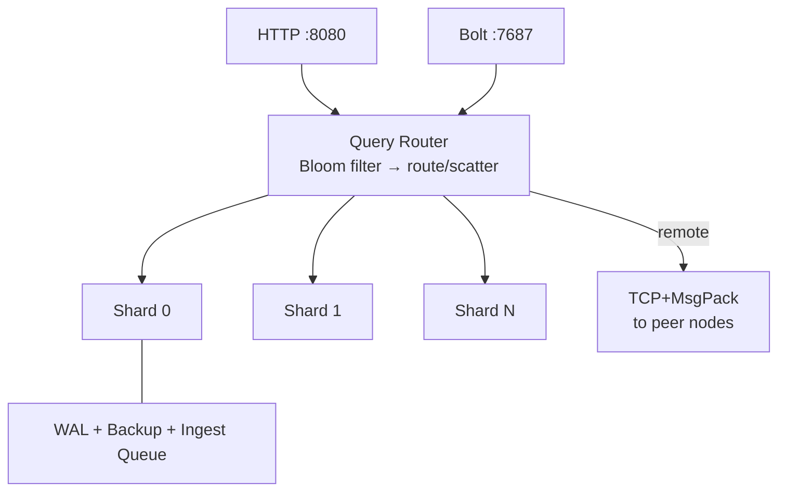

# Loveliness

[](https://github.com/dreamware-nz/loveliness/actions/workflows/ci.yml)
[](https://go.dev)
[](LICENSE)
[](https://hub.docker.com/r/dreamwarenz/loveliness)

A clustered graph database built on [LadybugDB](https://github.com/LadybugDB/ladybug) — like Elasticsearch is to Lucene, Loveliness is to LadybugDB.

> *A "loveliness" is the collective noun for a group of ladybugs.*

LadybugDB is a Kuzu fork — a fast, embedded, columnar graph engine with Cypher support. Loveliness wraps it in a distributed layer: hash-based sharding, Raft consensus, Bloom filter routing, edge-cut replication, and Neo4j Bolt protocol compatibility. Single Go binary, no external dependencies.

## Architecture



## Performance (15.7M nodes, 10M edges, 4 shards)

| Query Type | P50 | QPS |
|---|---|---|
| Point lookup | **425us** | 10,758 |
| 1-hop traversal | **673us** | 1,106 |
| Single write | **365us** | 2,526 |
| Aggregation | **57ms** | 16 |
| 2-hop traversal | **162ms** | 5 |
| Bulk load | **70–190K nodes/sec** | — |

Full benchmarks and comparisons with Neo4j, Memgraph, TigerGraph, Neptune, and JanusGraph: [docs/benchmarks.md](docs/benchmarks.md)

## Neo4j Driver Compatibility

Speaks Bolt v4.x on `:7687`. Use any Neo4j driver — just change the URL.

```python
from neo4j import GraphDatabase
driver = GraphDatabase.driver("bolt://localhost:7687")
with driver.session() as session:
    result = session.run("MATCH (p:Person {name: $name}) RETURN p.name, p.age", name="Alice")
```

72/72 exhaustive tests pass with the official Python driver. Details: [docs/bolt.md](docs/bolt.md)

## Quick Start

```bash
git clone https://github.com/dreamware-nz/loveliness.git && cd loveliness

make build      # requires LadybugDB: curl -fsSL https://install.ladybugdb.com | sh
make run        # single node → :8080 (HTTP), :7687 (Bolt)
make docker     # 3-node cluster via Docker Compose
make test       # 221 tests across 10 packages
```

## Usage

```bash
# Schema (broadcast to all shards)
curl -s localhost:8080/cypher -d "CREATE NODE TABLE Person(name STRING, age INT64, PRIMARY KEY(name))"

# Write (routed to owning shard)
curl -s localhost:8080/cypher -d "CREATE (p:Person {name: 'Alice', age: 30})"

# Read (Bloom filter → single shard)
curl -s localhost:8080/cypher -d "MATCH (p:Person {name: 'Alice'}) RETURN p"

# Bulk load
curl -s localhost:8080/bulk/nodes -H "X-Table: Person" --data-binary @persons.csv

# Async ingest (returns 202 with job ID)
curl -s -X POST localhost:8080/ingest/nodes -H "X-Table: Person" --data-binary @persons.csv
```

Full API reference: [docs/api.md](docs/api.md)

## Docker

```bash
# Single image
docker run -p 8080:8080 -p 7687:7687 dreamwarenz/loveliness

# 3-node cluster
docker compose up
```

## Kubernetes

```bash
kubectl apply -f deploy/k8s/namespace.yml
kubectl apply -f deploy/k8s/service.yml
kubectl apply -f deploy/k8s/statefulset.yml
```

StatefulSet with headless service, persistent volumes, health probes. Details: [docs/kubernetes.md](docs/kubernetes.md)

## Security

### Authentication

One env var enables token auth across HTTP and Bolt:

```bash
export LOVELINESS_AUTH_TOKEN=my-secret
```

- **HTTP**: all endpoints except `/health` require `Authorization: Bearer <token>`
- **Bolt**: pass the token as the password in your driver auth (`auth=("neo4j", "my-secret")`)
- **Disabled by default**: empty token = open access (dev mode)

Details: [docs/configuration.md](docs/configuration.md#authentication)

### TLS

All transports support TLS. Three env vars enable it:

```bash
export LOVELINESS_TLS_CERT=/path/to/server.crt
export LOVELINESS_TLS_KEY=/path/to/server.key
export LOVELINESS_TLS_CA=/path/to/ca.crt   # enables mTLS for inter-node traffic
export LOVELINESS_TLS_MODE=required
```

| Boundary | What's encrypted | TLS type |
|---|---|---|
| Client → Node | HTTP `:8080`, Bolt `:7687` | Server TLS |
| Node → Node | TCP transport `:9001`, Raft | mTLS (cluster CA) |

Without these vars, all listeners run plaintext (dev default). Details: [docs/configuration.md](docs/configuration.md#tls)

## Documentation

| Doc | Contents |
|---|---|
| [Architecture](docs/architecture.md) | System design, query/write lifecycle, optimization phases, edge-cut replication, CGo safety |
| [Benchmarks](docs/benchmarks.md) | Performance numbers, comparisons, transport benchmarks |
| [Bolt Protocol](docs/bolt.md) | Neo4j driver compatibility, examples, test results |
| [API Reference](docs/api.md) | HTTP endpoints, bulk loading, ingest queue, DR, consistency |
| [Configuration](docs/configuration.md) | Environment variables, TLS, shard count guidance |
| [Kubernetes](docs/kubernetes.md) | StatefulSet deployment, scaling, backup to S3 |
| [Project Structure](docs/project-structure.md) | Package layout and file descriptions |
| [Contributing](CONTRIBUTING.md) | Development setup, PR guidelines |

## License

[MIT](LICENSE)
