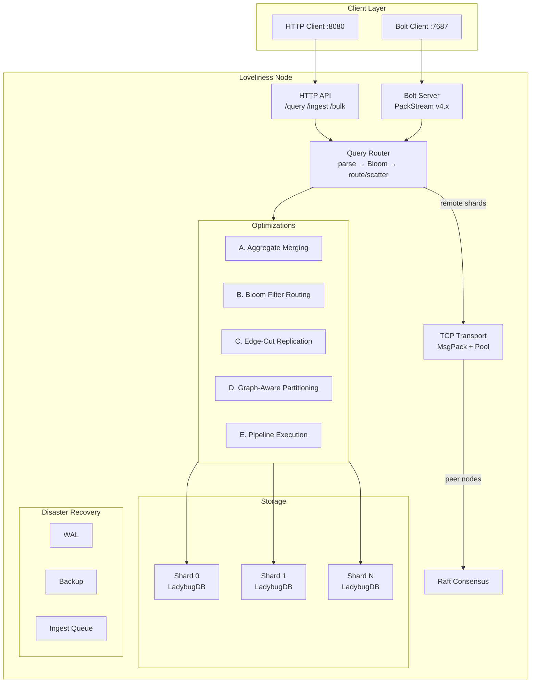
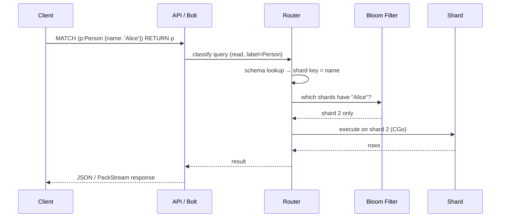
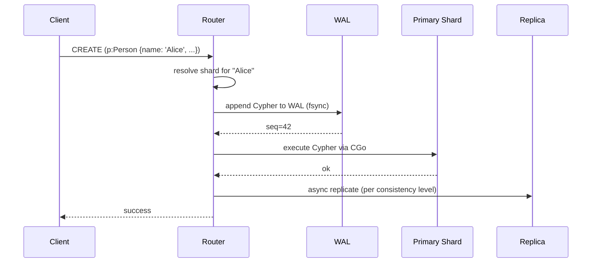
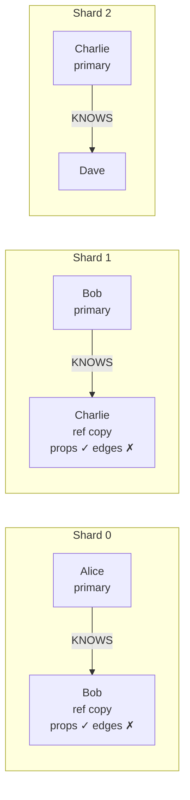

# Architecture

## Overview

## Key Properties

- **Declared shard keys** — each node table has a PRIMARY KEY that determines shard routing via FNV-32a hashing
- **Bloom filter routing** — per-shard probabilistic index (5M keys, 1% FPR, ~6MB per shard) routes point lookups to a single shard instead of scatter-gathering
- **Edge-cut replication** — border nodes are replicated with full properties across shards so 1-hop traversals resolve locally
- **Aggregate pushdown** — AVG is rewritten to SUM+COUNT per shard, merged at the router; ORDER BY, LIMIT, and DISTINCT applied post-merge
- **Pipeline execution** — multi-hop traversals overlap across shards
- **WAL + backup/restore** — per-shard write-ahead log with backup to local disk or S3
- **Log-backed ingest queue** — async bulk loading with durable job state
- **TCP+MsgPack transport** — binary framed protocol for inter-node queries, 2-4x faster than HTTP+JSON

## Query Lifecycle

## Write Lifecycle

## Edge-Cut Replication

When an edge crosses shard boundaries, the target node is replicated (with full properties) to the source shard. This means 1-hop traversals resolve locally.

**Why doesn't this cascade?** Ref copies are property stubs — they have the node's data but not its edges.

This means:
- **1-hop** (Alice→Bob): Resolves locally on shard 0. Bob's ref copy has his properties. **No cross-shard call.**
- **2-hop** (Alice→Bob→Charlie): Shard 0 resolves Alice→Bob locally, but Bob's ref copy has no edges. To find Bob→Charlie, the router must go to shard 1. **One cross-shard call.**
- **N-hop**: Each hop beyond the first requires a cross-shard call. Replication does not cascade.

This is a deliberate trade-off: ref copies are cheap (one extra MERGE per border node) and make the most common query pattern (1-hop neighborhood) fast, without the storage explosion that full-depth replication would cause. At 15M nodes with 4 shards, ~75% of edges cross shard boundaries, which would mean replicating the entire graph to every shard if edges were included.

## Query Optimization Phases

### Phase A: Aggregate Merging
Rewrites `AVG(x)` to `SUM(x)` + `COUNT(x)` per shard, then merges at the router. Also handles post-merge `ORDER BY`, `LIMIT`, and `DISTINCT`.

### Phase B: Bloom Filter Routing
Per-shard probabilistic index (5M keys, 1% false positive rate, ~6MB each). Point lookups check the Bloom filter first — if only one shard reports "maybe", the query skips the other shards entirely.

### Phase C: Edge-Cut Replication
See [above](#edge-cut-replication).

### Phase D: Graph-Aware Partitioning
Label propagation community detection identifies tightly-connected subgraphs. Used to suggest shard migrations that reduce cross-shard edge cuts.

### Phase E: Pipeline Execution
Multi-hop traversals overlap across shards — while shard 0 processes hop 2, shard 1 processes hop 1. Reduces serial round-trip latency.

## CGo Safety

LadybugDB runs via CGo (go-ladybug bindings). Each shard has:
- A **semaphore** limiting concurrent CGo calls (prevents thread exhaustion)
- **Panic recovery** that catches CGo crashes and marks the shard unhealthy instead of crashing the process
- **Thread pool configuration** (`runtime.NumCPU() / shardCount` threads per shard) to prevent CPU oversubscription

## Supported Cypher

Loveliness passes all Cypher through to LadybugDB — the router only classifies queries for routing, it doesn't validate syntax.

| Category | Clauses | Routing |
|---|---|---|
| **Reads** | `MATCH`, `OPTIONAL MATCH`, `WITH`, `UNWIND`, `CALL`, `RETURN`, `ORDER BY`, `LIMIT` | Shard key → single shard; no key → scatter-gather |
| **Writes** | `CREATE`, `MERGE`, `SET`, `DELETE`, `DETACH DELETE`, `REMOVE` | Shard key required; routes to owning shard |
| **Schema DDL** | `CREATE NODE TABLE`, `CREATE REL TABLE`, `DROP TABLE`, `ALTER` | Broadcast to all shards |
| **Bulk** | `COPY FROM` | Via `/bulk/nodes` or `/bulk/edges` endpoints |
