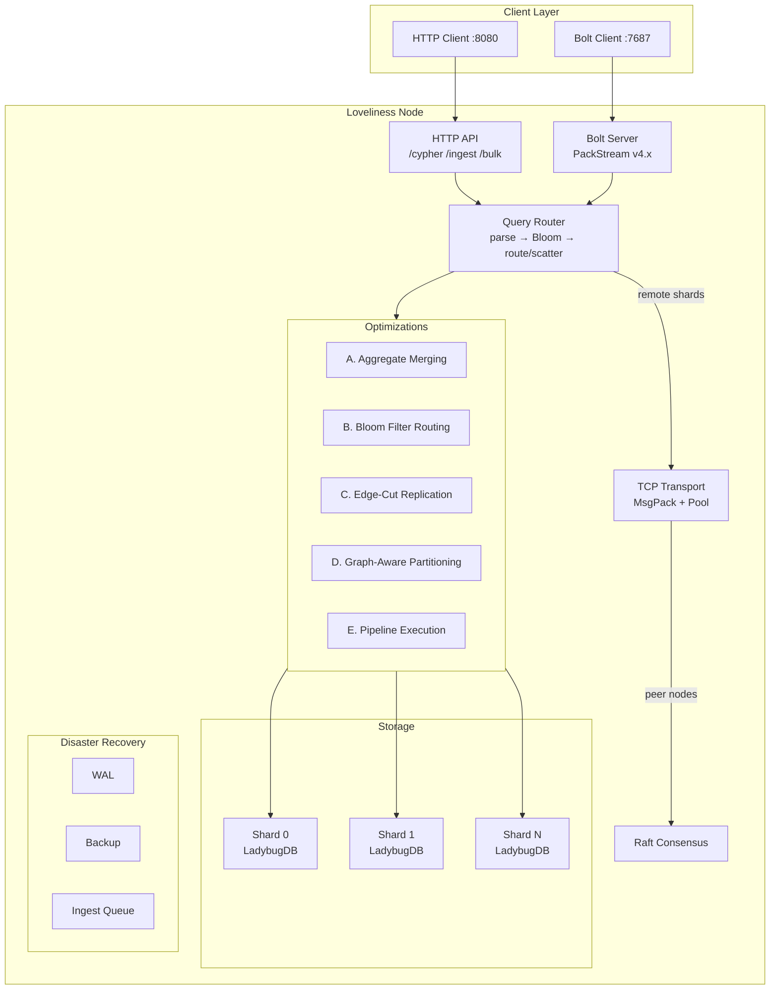
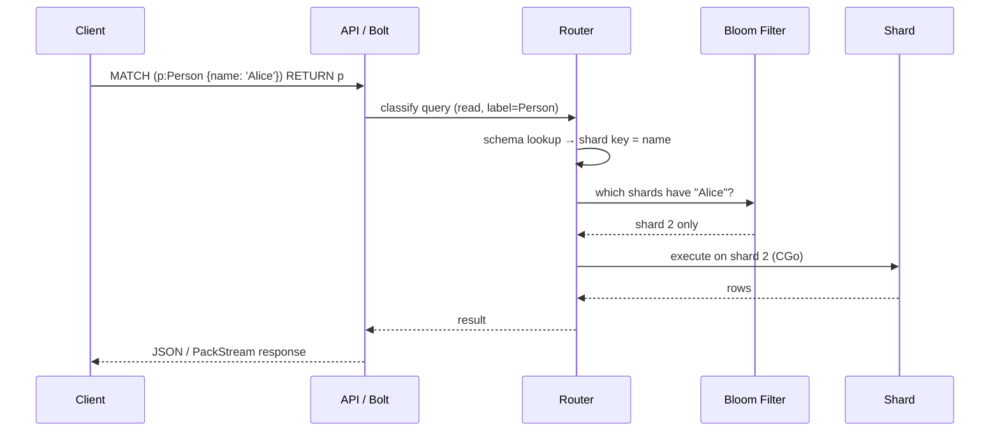
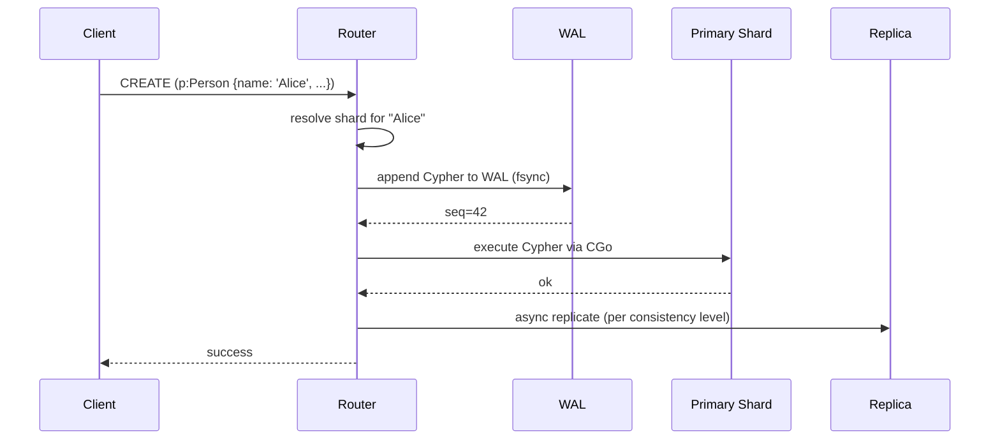
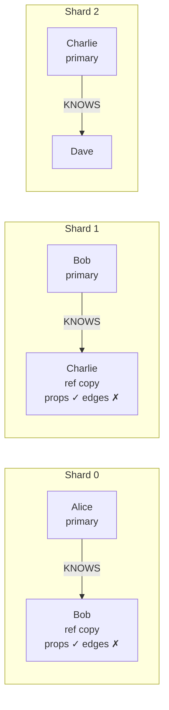
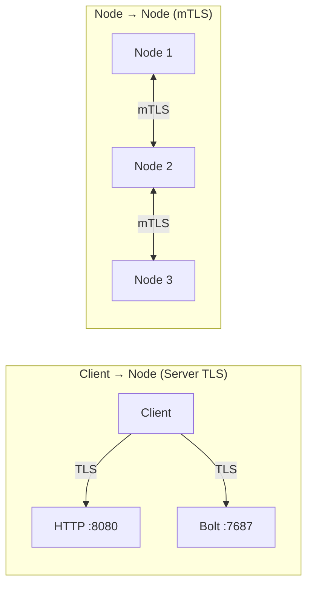

# Architecture

## Overview

## Key Properties

- **Declared shard keys** — each node table has a PRIMARY KEY that determines shard routing via FNV-32a hashing
- **Bloom filter routing** — per-shard probabilistic index (5M keys, 1% FPR, ~6MB per shard) routes point lookups to a single shard instead of scatter-gathering
- **Edge-cut replication** — border nodes are replicated with full properties across shards so 1-hop traversals resolve locally
- **Aggregate pushdown** — AVG is rewritten to SUM+COUNT per shard, merged at the router; ORDER BY, LIMIT, and DISTINCT applied post-merge
- **Pipeline execution** — multi-hop traversals overlap across shards
- **WAL + backup/restore** — per-shard write-ahead log with backup to local disk or S3
- **Log-backed ingest queue** — async bulk loading with durable job state
- **TCP+MsgPack transport** — binary framed protocol for inter-node queries, 2-4x faster than HTTP+JSON

## Query Lifecycle

## Write Lifecycle

## Edge-Cut Replication

When an edge crosses shard boundaries, the target node is replicated (with full properties) to the source shard. This means 1-hop traversals resolve locally.

**Why doesn't this cascade?** Ref copies are property stubs — they have the node's data but not its edges.

This means:
- **1-hop** (Alice→Bob): Resolves locally on shard 0. Bob's ref copy has his properties. **No cross-shard call.**
- **2-hop** (Alice→Bob→Charlie): Shard 0 resolves Alice→Bob locally, but Bob's ref copy has no edges. To find Bob→Charlie, the router must go to shard 1. **One cross-shard call.**
- **N-hop**: Each hop beyond the first requires a cross-shard call. Replication does not cascade.

This is a deliberate trade-off: ref copies are cheap (one extra MERGE per border node) and make the most common query pattern (1-hop neighborhood) fast, without the storage explosion that full-depth replication would cause. At 15M nodes with 4 shards, ~75% of edges cross shard boundaries, which would mean replicating the entire graph to every shard if edges were included.

## Query Optimization Phases

### Phase A: Aggregate Merging
Rewrites `AVG(x)` to `SUM(x)` + `COUNT(x)` per shard, then merges at the router. Also handles post-merge `ORDER BY`, `LIMIT`, and `DISTINCT`.

### Phase B: Bloom Filter Routing
Per-shard probabilistic index (5M keys, 1% false positive rate, ~6MB each). Point lookups check the Bloom filter first — if only one shard reports "maybe", the query skips the other shards entirely.

### Phase C: Edge-Cut Replication
See [above](#edge-cut-replication).

### Phase D: Graph-Aware Partitioning
Label propagation community detection identifies tightly-connected subgraphs. Used to suggest shard migrations that reduce cross-shard edge cuts.

### Phase E: Pipeline Execution
Multi-hop traversals overlap across shards — while shard 0 processes hop 2, shard 1 processes hop 1. Reduces serial round-trip latency.

## CGo Safety

LadybugDB runs via CGo (go-ladybug bindings). Each shard has:
- A **semaphore** limiting concurrent CGo calls (prevents thread exhaustion)
- **Panic recovery** that catches CGo crashes and marks the shard unhealthy instead of crashing the process
- **Thread pool configuration** (`runtime.NumCPU() / shardCount` threads per shard) to prevent CPU oversubscription

## Core Design Decisions

### Shard keys are declared, not inferred

Every node table has a `PRIMARY KEY` that becomes its shard key. When you run `CREATE NODE TABLE Person(name STRING, age INT64, PRIMARY KEY(name))`, the schema registry records that `Person` is sharded on `name`. All subsequent queries involving `Person` nodes use only the `name` property for routing.

This prevents the critical bug where two queries about the same node route to different shards because they filter on different properties.

### Shards are placed, not replicated everywhere

Each shard has a **primary** (handles reads and writes) and a **replica** (receives replicated writes, can be promoted on failure). A node only opens the LadybugDB instances for shards assigned to it. `pkg/shard/manager.go` watches the Raft FSM's shard map and opens/closes shards as assignments change.

### Queries cross node boundaries transparently

When the router determines a query's target shard is on another node, it forwards the request via TCP+MsgPack (or HTTP fallback). The client sees the same response regardless of which node they hit.

### Write replication is Cypher-level replay

After the primary shard executes a write, the replicator sends the same Cypher statement to the replica node(s). Three consistency levels: `ONE` (fire-and-forget), `QUORUM` (primary + 1 replica, default), `ALL`.

### Rebalancing is leader-driven

When nodes join or leave, the leader computes a migration plan: fix primaries on dead nodes, rebalance overloaded nodes, ensure every shard has a replica on a different node than its primary. `pkg/cluster/rebalancer.go` produces a `[]Move` plan (pure function, testable).

## Raft State Machine

The FSM manages cluster-wide state via four command types:

| Command | Effect |
|---|---|
| `CmdAssignShard` | Set shard ownership (primary + replica) |
| `CmdJoinNode` | Register a node with its addresses |
| `CmdRemoveNode` | Mark a node as dead |
| `CmdPromoteReplica` | Promote replica to primary, clear replica slot |
| `CmdRegisterSchema` | Persist table→shard key mapping (survives restarts) |
| `CmdRemoveSchema` | Remove a table's schema entry on DROP TABLE |

State is snapshotted as JSON and can be restored on any node.

## Component Map

| Package | Responsibility |
|---|---|
| `pkg/schema` | Table → shard key mapping, DDL parsing |
| `pkg/shard` | LadybugDB lifecycle, concurrency control |
| `pkg/router` | Cypher classification, shard key extraction, routing |
| `pkg/transport` | TCP+MsgPack inter-node communication with connection pooling |
| `pkg/replication` | Write fan-out with consistency levels, WAL, catch-up |
| `pkg/cluster` | Raft FSM, membership, rebalancing, locality |
| `pkg/bolt` | Neo4j Bolt protocol server (v4.x), PackStream serialization, cluster-aware ROUTE |
| `pkg/api` | HTTP API, bulk loading, ingest queue, DR |
| `pkg/backup` | Backup/restore to local disk or S3 |
| `pkg/ingest` | Log-backed async ingest queue |
| `pkg/auth` | Token authentication: HTTP Bearer middleware, Bolt credential check |
| `pkg/tlsutil` | Shared TLS config: server TLS, mTLS, client TLS |
| `pkg/config` | Environment variable configuration |
| `pkg/logging` | Structured JSON logging |

## TLS and Trust Boundaries

Three trust boundaries, each with its own TLS model:

| Boundary | Transports | TLS type | What it proves |
|---|---|---|---|
| **Client → Node** | HTTP `:8080`, Bolt `:7687` | Server TLS | Server is who it claims to be |
| **Node → Node** | TCP `:9001` (MsgPack), Raft | mTLS | Both sides hold certs signed by the cluster CA |
| **Admin → Node** | `/join`, `/backup`, `/restore` | Server TLS + auth | Encrypted channel + identity (see auth) |

**mTLS for inter-node traffic:** all nodes share a cluster CA. Each node presents a certificate signed by that CA. Connections from unknown certificates are rejected at the TLS handshake — before any application data is exchanged. This is the foundation for secure cluster join: a node can only communicate with the cluster if it holds a valid cert.

Configuration: `LOVELINESS_TLS_CERT`, `LOVELINESS_TLS_KEY`, `LOVELINESS_TLS_CA`, `LOVELINESS_TLS_MODE`. See [Configuration](configuration.md#tls).

## Supported Cypher

Loveliness passes all Cypher through to LadybugDB — the router only classifies queries for routing, it doesn't validate syntax.

| Category | Clauses | Routing |
|---|---|---|
| **Reads** | `MATCH`, `OPTIONAL MATCH`, `WITH`, `UNWIND`, `CALL`, `RETURN`, `ORDER BY`, `LIMIT` | Shard key → single shard; no key → scatter-gather |
| **Writes** | `CREATE`, `MERGE`, `SET`, `DELETE`, `DETACH DELETE`, `REMOVE` | Shard key required; routes to owning shard |
| **Schema DDL** | `CREATE NODE TABLE`, `CREATE REL TABLE`, `DROP TABLE`, `ALTER` | Broadcast to all shards |
| **Bulk** | `COPY FROM` | Via `/bulk/nodes` or `/bulk/edges` endpoints |
