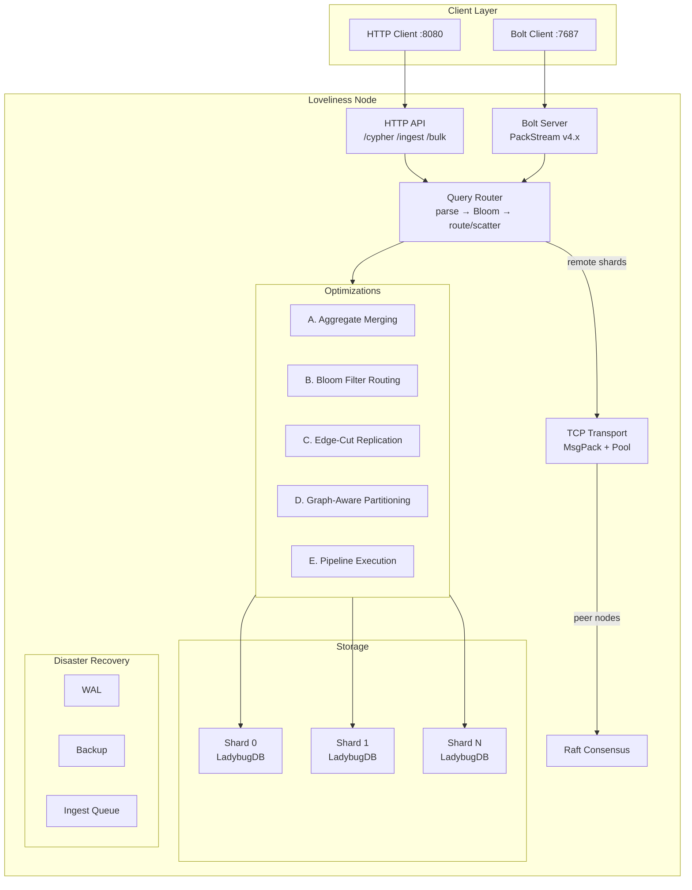
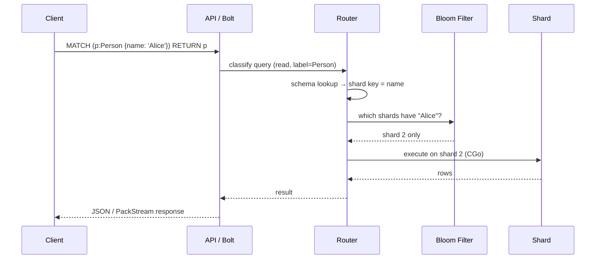
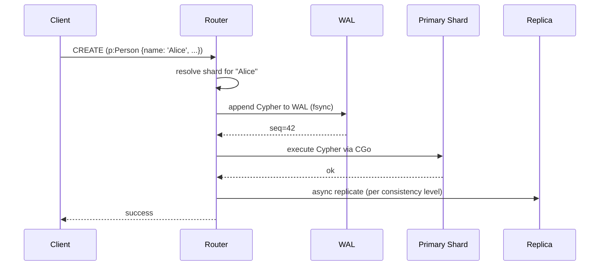
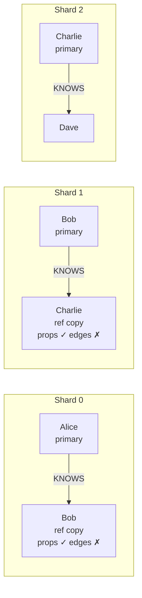
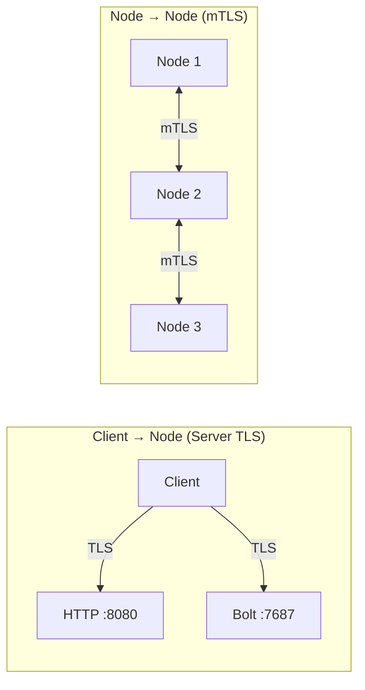

# Architecture

## Overview

```mermaid
graph TB
    subgraph Client Layer
        HTTP[HTTP Client :8080]
        Bolt[Bolt Client :7687]
    end

    subgraph Node["Loveliness Node"]
        API[HTTP API<br/>/cypher /ingest /bulk]
        BoltSrv[Bolt Server<br/>PackStream v4.x]
        Router[Query Router<br/>parse → Bloom → route/scatter]
        Raft[Raft Consensus]
        TCP[TCP Transport<br/>MsgPack + Pool]

        subgraph Optimizations
            A[A. Aggregate Merging]
            B[B. Bloom Filter Routing]
            C[C. Edge-Cut Replication]
            D[D. Graph-Aware Partitioning]
            E[E. Pipeline Execution]
        end

        subgraph Storage
            S0[Shard 0<br/>LadybugDB]
            S1[Shard 1<br/>LadybugDB]
            S2[Shard N<br/>LadybugDB]
        end

        subgraph DR["Disaster Recovery"]
            WAL[WAL]
            Backup[Backup]
            Ingest[Ingest Queue]
        end
    end

    HTTP --> API
    Bolt --> BoltSrv
    API --> Router
    BoltSrv --> Router
    Router --> Optimizations
    Optimizations --> S0
    Optimizations --> S1
    Optimizations --> S2
    Router -- remote shards --> TCP
    TCP -- peer nodes --> Raft
```

## Key Properties

- **Declared shard keys** — each node table has a PRIMARY KEY that determines shard routing via FNV-32a hashing
- **Bloom filter routing** — per-shard probabilistic index (5M keys, 1% FPR, ~6MB per shard) routes point lookups to a single shard instead of scatter-gathering
- **Edge-cut replication** — border nodes are replicated with full properties across shards so 1-hop traversals resolve locally
- **Aggregate pushdown** — AVG is rewritten to SUM+COUNT per shard, merged at the router; ORDER BY, LIMIT, and DISTINCT applied post-merge
- **Pipeline execution** — multi-hop traversals overlap across shards
- **WAL + backup/restore** — per-shard write-ahead log with backup to local disk or S3
- **Log-backed ingest queue** — async bulk loading with durable job state
- **TCP+MsgPack transport** — binary framed protocol for inter-node queries, 2-4x faster than HTTP+JSON

## Query Lifecycle

```mermaid
sequenceDiagram
    participant C as Client
    participant A as API / Bolt
    participant R as Router
    participant B as Bloom Filter
    participant S as Shard

    C->>A: MATCH (p:Person {name: 'Alice'}) RETURN p
    A->>R: classify query (read, label=Person)
    R->>R: schema lookup → shard key = name
    R->>B: which shards have "Alice"?
    B-->>R: shard 2 only
    R->>S: execute on shard 2 (CGo)
    S-->>R: rows
    R-->>A: result
    A-->>C: JSON / PackStream response
```

## Write Lifecycle

```mermaid
sequenceDiagram
    participant C as Client
    participant R as Router
    participant W as WAL
    participant S as Primary Shard
    participant Rep as Replica

    C->>R: CREATE (p:Person {name: 'Alice', ...})
    R->>R: resolve shard for "Alice"
    R->>W: append Cypher to WAL (fsync)
    W-->>R: seq=42
    R->>S: execute Cypher via CGo
    S-->>R: ok
    R->>Rep: async replicate (per consistency level)
    R-->>C: success
```

## Edge-Cut Replication

When an edge crosses shard boundaries, the target node is replicated (with full properties) to the source shard. This means 1-hop traversals resolve locally.

**Why doesn't this cascade?** Ref copies are property stubs — they have the node's data but not its edges.

```mermaid
graph LR
    subgraph Shard 0
        A[Alice<br/>primary]
        B_ref[Bob<br/>ref copy<br/>props ✓ edges ✗]
        A -->|KNOWS| B_ref
    end

    subgraph Shard 1
        B[Bob<br/>primary]
        C_ref[Charlie<br/>ref copy<br/>props ✓ edges ✗]
        B -->|KNOWS| C_ref
    end

    subgraph Shard 2
        C[Charlie<br/>primary]
        C -->|KNOWS| D[Dave]
    end
```

This means:
- **1-hop** (Alice→Bob): Resolves locally on shard 0. Bob's ref copy has his properties. **No cross-shard call.**
- **2-hop** (Alice→Bob→Charlie): Shard 0 resolves Alice→Bob locally, but Bob's ref copy has no edges. To find Bob→Charlie, the router must go to shard 1. **One cross-shard call.**
- **N-hop**: Each hop beyond the first requires a cross-shard call. Replication does not cascade.

This is a deliberate trade-off: ref copies are cheap (one extra MERGE per border node) and make the most common query pattern (1-hop neighborhood) fast, without the storage explosion that full-depth replication would cause. At 15M nodes with 4 shards, ~75% of edges cross shard boundaries, which would mean replicating the entire graph to every shard if edges were included.

## Query Optimization Phases

### Phase A: Aggregate Merging
Rewrites `AVG(x)` to `SUM(x)` + `COUNT(x)` per shard, then merges at the router. Also handles post-merge `ORDER BY`, `LIMIT`, and `DISTINCT`.

### Phase B: Bloom Filter Routing
Per-shard probabilistic index (5M keys, 1% false positive rate, ~6MB each). Point lookups check the Bloom filter first — if only one shard reports "maybe", the query skips the other shards entirely.

### Phase C: Edge-Cut Replication
See [above](#edge-cut-replication).

### Phase D: Graph-Aware Partitioning
Label propagation community detection identifies tightly-connected subgraphs. Used to suggest shard migrations that reduce cross-shard edge cuts.

### Phase E: Pipeline Execution
Multi-hop traversals overlap across shards — while shard 0 processes hop 2, shard 1 processes hop 1. Reduces serial round-trip latency.

## CGo Safety

LadybugDB runs via CGo (go-ladybug bindings). Each shard has:
- A **semaphore** limiting concurrent CGo calls (prevents thread exhaustion)
- **Panic recovery** that catches CGo crashes and marks the shard unhealthy instead of crashing the process
- **Thread pool configuration** (`runtime.NumCPU() / shardCount` threads per shard) to prevent CPU oversubscription

## Core Design Decisions

### Shard keys are declared, not inferred

Every node table has a `PRIMARY KEY` that becomes its shard key. When you run `CREATE NODE TABLE Person(name STRING, age INT64, PRIMARY KEY(name))`, the schema registry records that `Person` is sharded on `name`. All subsequent queries involving `Person` nodes use only the `name` property for routing.

This prevents the critical bug where two queries about the same node route to different shards because they filter on different properties.

### Shards are placed, not replicated everywhere

Each shard has a **primary** (handles reads and writes) and a **replica** (receives replicated writes, can be promoted on failure). A node only opens the LadybugDB instances for shards assigned to it. `pkg/shard/manager.go` watches the Raft FSM's shard map and opens/closes shards as assignments change.

### Queries cross node boundaries transparently

When the router determines a query's target shard is on another node, it forwards the request via TCP+MsgPack (or HTTP fallback). The client sees the same response regardless of which node they hit.

### Write replication is Cypher-level replay

After the primary shard executes a write, the replicator sends the same Cypher statement to the replica node(s). Three consistency levels: `ONE` (fire-and-forget), `QUORUM` (primary + 1 replica, default), `ALL`.

### Rebalancing is leader-driven

When nodes join or leave, the leader computes a migration plan: fix primaries on dead nodes, rebalance overloaded nodes, ensure every shard has a replica on a different node than its primary. `pkg/cluster/rebalancer.go` produces a `[]Move` plan (pure function, testable).

## Raft State Machine

The FSM manages cluster-wide state via four command types:

| Command | Effect |
|---|---|
| `CmdAssignShard` | Set shard ownership (primary + replica) |
| `CmdJoinNode` | Register a node with its addresses |
| `CmdRemoveNode` | Mark a node as dead |
| `CmdPromoteReplica` | Promote replica to primary, clear replica slot |
| `CmdRegisterSchema` | Persist table→shard key mapping (survives restarts) |
| `CmdRemoveSchema` | Remove a table's schema entry on DROP TABLE |

State is snapshotted as JSON and can be restored on any node.

## Component Map

| Package | Responsibility |
|---|---|
| `pkg/schema` | Table → shard key mapping, DDL parsing |
| `pkg/shard` | LadybugDB lifecycle, concurrency control |
| `pkg/router` | Cypher classification, shard key extraction, routing |
| `pkg/transport` | TCP+MsgPack inter-node communication with connection pooling |
| `pkg/replication` | Write fan-out with consistency levels, WAL, catch-up |
| `pkg/cluster` | Raft FSM, membership, rebalancing, locality |
| `pkg/bolt` | Neo4j Bolt protocol server (v4.x), PackStream serialization, cluster-aware ROUTE |
| `pkg/api` | HTTP API, bulk loading, ingest queue, DR |
| `pkg/backup` | Backup/restore to local disk or S3 |
| `pkg/ingest` | Log-backed async ingest queue |
| `pkg/auth` | Token authentication: HTTP Bearer middleware, Bolt credential check |
| `pkg/tlsutil` | Shared TLS config: server TLS, mTLS, client TLS |
| `pkg/config` | Environment variable configuration |
| `pkg/logging` | Structured JSON logging |

## TLS and Trust Boundaries

```mermaid
graph LR
    subgraph External["Client → Node (Server TLS)"]
        C[Client] -->|TLS| HTTP[HTTP :8080]
        C -->|TLS| Bolt[Bolt :7687]
    end

    subgraph Internal["Node → Node (mTLS)"]
        N1[Node 1] <-->|mTLS| N2[Node 2]
        N2 <-->|mTLS| N3[Node 3]
    end
```

Three trust boundaries, each with its own TLS model:

| Boundary | Transports | TLS type | What it proves |
|---|---|---|---|
| **Client → Node** | HTTP `:8080`, Bolt `:7687` | Server TLS | Server is who it claims to be |
| **Node → Node** | TCP `:9001` (MsgPack), Raft | mTLS | Both sides hold certs signed by the cluster CA |
| **Admin → Node** | `/join`, `/backup`, `/restore` | Server TLS + auth | Encrypted channel + identity (see auth) |

**mTLS for inter-node traffic:** all nodes share a cluster CA. Each node presents a certificate signed by that CA. Connections from unknown certificates are rejected at the TLS handshake — before any application data is exchanged. This is the foundation for secure cluster join: a node can only communicate with the cluster if it holds a valid cert.

Configuration: `LOVELINESS_TLS_CERT`, `LOVELINESS_TLS_KEY`, `LOVELINESS_TLS_CA`, `LOVELINESS_TLS_MODE`. See [Configuration](configuration.md#tls).

## Supported Cypher

Loveliness passes all Cypher through to LadybugDB — the router only classifies queries for routing, it doesn't validate syntax.

| Category | Clauses | Routing |
|---|---|---|
| **Reads** | `MATCH`, `OPTIONAL MATCH`, `WITH`, `UNWIND`, `CALL`, `RETURN`, `ORDER BY`, `LIMIT` | Shard key → single shard; no key → scatter-gather |
| **Writes** | `CREATE`, `MERGE`, `SET`, `DELETE`, `DETACH DELETE`, `REMOVE` | Shard key required; routes to owning shard |
| **Schema DDL** | `CREATE NODE TABLE`, `CREATE REL TABLE`, `DROP TABLE`, `ALTER` | Broadcast to all shards |
| **Bulk** | `COPY FROM` | Via `/bulk/nodes` or `/bulk/edges` endpoints |

## Cross-node transport gaps

The current TCP+msgpack transport is "good loopback" but has ten known gaps before it's a production-grade cross-node transport. The full analysis lives in [`spike/cross-node-transport/FINDINGS.md`](../spike/cross-node-transport/FINDINGS.md); a prior-art survey of four distributed graph and SQL systems is in [`SURVEY.md`](../spike/cross-node-transport/SURVEY.md).

Categorisation, recorded so we don't re-discover the same gaps next time someone polishes the router:

| # | Gap | Category | Follow-up | Rationale |
|---|---|---|---|---|
| 1 | `TCPServer.handleConn` waits on idle deadline at shutdown | must-fix-pre-prod | done in [#93](https://github.com/dreamware-nz/loveliness/pull/93) (was [#83](https://github.com/dreamware-nz/loveliness/issues/83)) | A rolling restart of an N-node cluster takes ≥ N minutes of wallclock; mechanical fix (`SetReadDeadline(now)` when `stopCh` fires). |
| 2 | TCPPool size vs scatter cap uncoordinated | should-fix-soon | [#88](https://github.com/dreamware-nz/loveliness/issues/88) | Not a correctness bug; a throughput bug under fan-out. Parked behind the v2-frame decision (#89) because streaming changes whether multiplexing or pool growth is the right answer. |
| 3 | No deadline propagation to remote shard | must-fix-pre-prod | in flight [#84](https://github.com/dreamware-nz/loveliness/issues/84) | A slow shard keeps running after the caller times out — wastes CPU and (for writes) can race late completions. Survey is unanimous on propagating deadlines on the wire. |
| 4 | No whole-query retry budget | must-fix-pre-prod | in flight [#85](https://github.com/dreamware-nz/loveliness/issues/85) | Per-shard retries × shard count is multiplicative; a 32-shard query with 2 retries each is 96 RPCs. Co-designed with #84 — retries after the deadline must not happen. |
| 5 | No streaming / chunked responses | frame-v2 dependent | [#89](https://github.com/dreamware-nz/loveliness/issues/89) | Universal in prior art. Cannot be retrofitted onto the v1 single-envelope reader without flag day; bundled with item 6 in a v2-frame design issue. |
| 6 | No cancel / partial-result signalling | frame-v2 dependent | [#89](https://github.com/dreamware-nz/loveliness/issues/89) | Same shape as item 5. Requires a server-side control opcode v1 never reserved. Ships with item 5 in the v2 frame. |
| 7 | No per-RPC correlation ID | should-fix-soon | in flight [#86](https://github.com/dreamware-nz/loveliness/issues/86) | The only v1-additive change in the list: a `request_id` field that old peers ignore. ~50 lines for a large debugging win. |
| 8 | mTLS not exercised in tests | won't-fix-in-transport | [#90](https://github.com/dreamware-nz/loveliness/issues/90) | Real gap, but it's a CI/test/docs gap — not a transport design gap. Filed as a `testing`-labelled follow-up. |
| 9 | No admission control / QoS | won't-fix-in-transport | [#91](https://github.com/dreamware-nz/loveliness/issues/91) | Belongs at the router/policy layer, not the transport. Filed as a roadmap issue for the router. |
| 10 | Pool eviction is reactive only | should-fix-soon | in flight [#87](https://github.com/dreamware-nz/loveliness/issues/87) | `MsgPing/MsgPong` exists in the wire format but no keepalive loop uses it. Single-file work; catches half-dead connections. |

**Frame-format decision:** item 7 ships as a v1-additive field. Items 5 and 6 require a v2 frame and ship together; the v2 frame is its own design issue with rolling-upgrade negotiation as a section. The v1 frame is otherwise stable.

When a must-fix lands, edit the relevant row to read `done in #N` rather than recreating decision records elsewhere.
